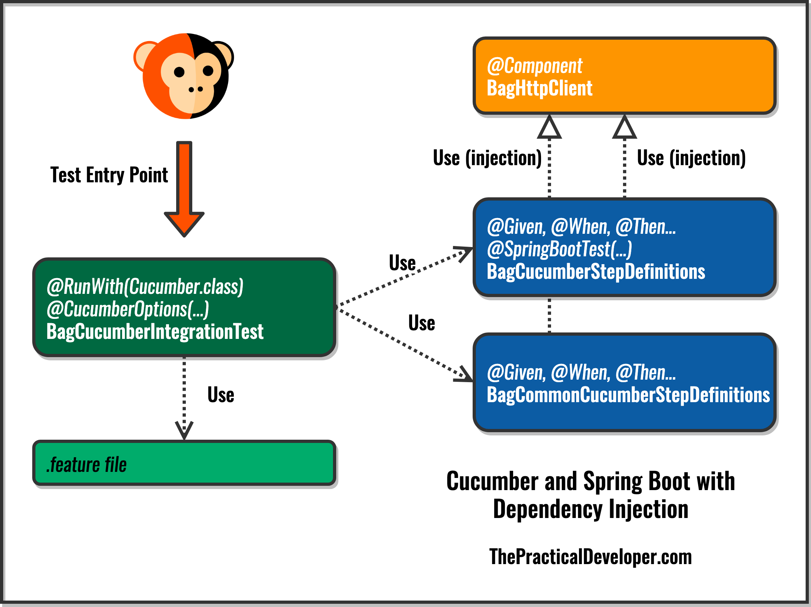

# Cucumber in Spring Boot using Dependency Injection

Use Cucumber Spring to manage state between steps and for scenarios.

This code sample shows how to use Dependency Injection in Cucumber within a Spring Boot application.

You can find the complete instructions on this post at The Practical Developer site: [https://thepracticaldeveloper.com/2018/03/31/cucumber-tests-spring-boot-dependency-injection/](https://thepracticaldeveloper.com/2018/03/31/cucumber-tests-spring-boot-dependency-injection/)

##Running 
####From feature file:
1) Run only single scenario from feature file
2) Run all feature 
From runner: 
1) Set needed tags which you want to run 
ex:
####From console:
1) mvn clean test -Dspring.profiles.active=wgu -Denv.name=qa -Dcucumber.options="--tags @HelpCenter"
Where :
a)'spring.profiles.active' is wgu, csu, ftk, hrz
b)'env.name' is qa, dev, stg
c)'cucumber.options' is all tags (can be added ignore tag)