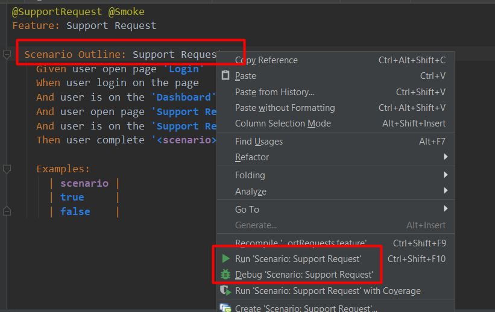
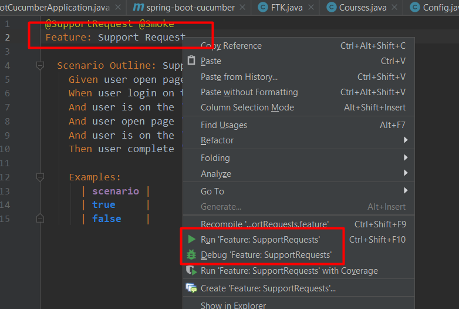
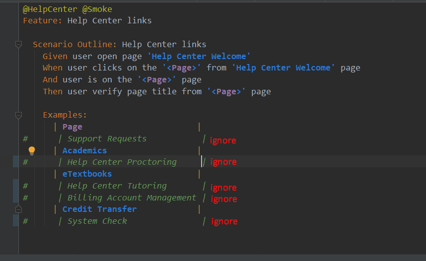
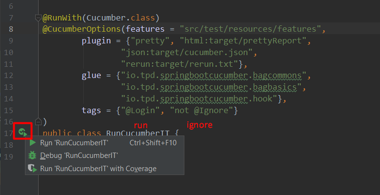

# BDD Automation Framework

Stack of technologies: Java, Maven, [Selenium](https://selenium.dev/documentation/en/), 
Junit, [Cucumber](https://cucumber.io/docs/guides/), Spring Boot, Yandex Elements, YAML

## Run mode

From console:
```bash
mvn clean test -Dspring.profiles.active=wgu -Denv.name=qa -Dcucumber.options="--tags @Admin,@Login,@SupportRequest,@Smoke --tags ~@HelpCenter"
```
```bash
#Examples:

#cucumber.options:
--tags @ExampleRunTag,@ExampleRunTagSecond.... - for run
--tags ~@ExampleIgnoreTag - for ignore

#spring.profiles.active:
select one of the existing tenants: wgu, csu, ftk, hrz

#env.name:
select one of the existing environment: qa, dev, stg, feature 
```

From IDEA: 
    a) Run single test 
     
    b) Run all tests from feature file
     
    c) Run specific iterations
     
    d) Run specific tags from runner
     
    